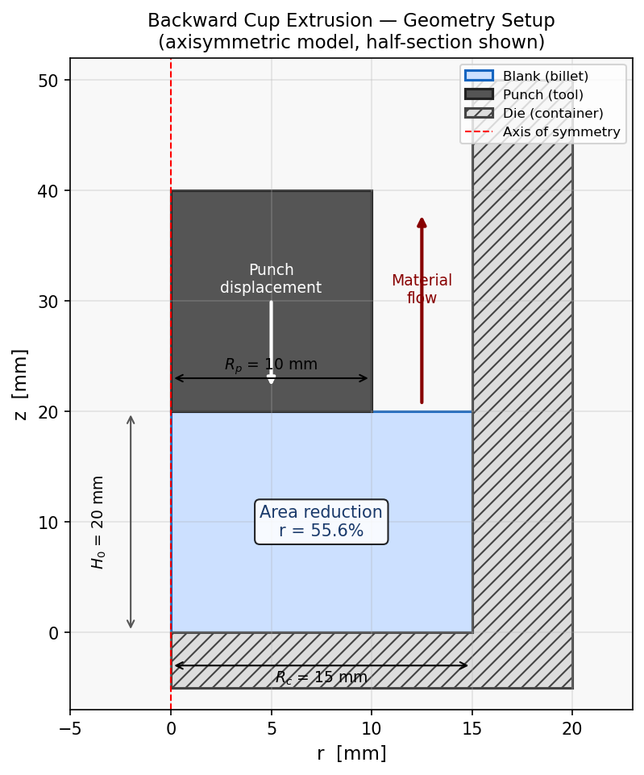
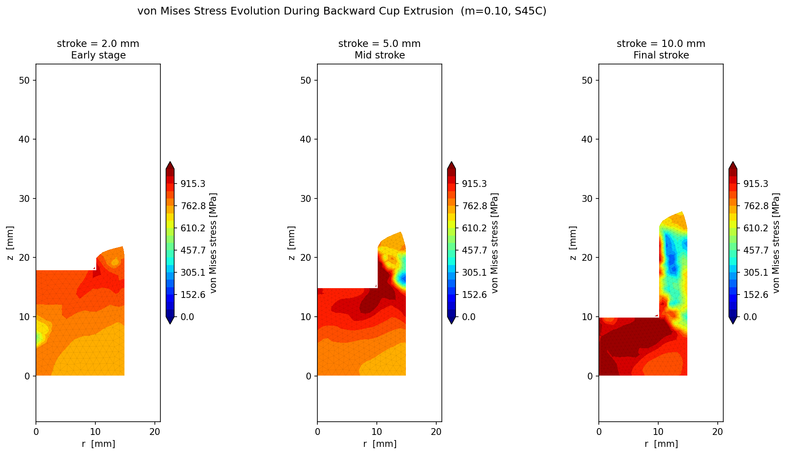
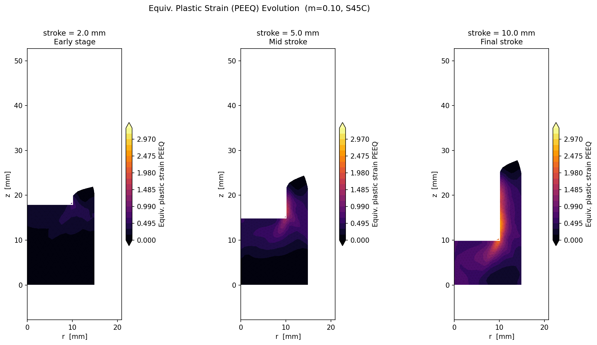
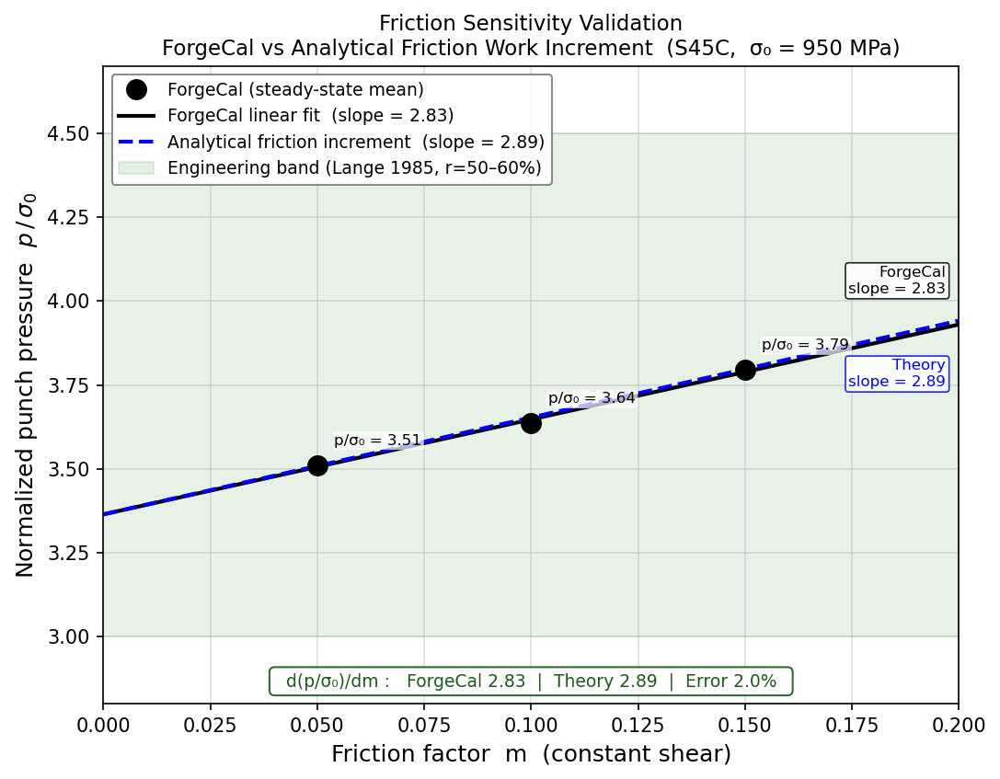

# Validating a 2D Metal Forming FEM Solver Against Classical Plasticity Theory

*Benchmark study: backward cup extrusion of S45C steel*

---

## Why Backward Cup Extrusion?

Validating a finite element solver for metal forming requires a process that is both analytically tractable and numerically demanding. **Backward cup extrusion** satisfies both criteria.

A flat punch descends into a billet confined in a cylindrical die. Metal has nowhere to go but *backwards* — flowing 180° around the punch nose to form a cup wall that grows upward. The large plastic strains (ε_eff > 3), multi-directional flow, and strong sensitivity to friction make it an ideal benchmark for elastoplastic contact FEM.

---

## Benchmark Setup

### Geometry


*Figure 1: Axisymmetric model (half-section). Billet starts as a solid cylinder; material flows upward through the annular gap as the punch descends.*

```
Parameter                          Value
─────────────────────────────────────────
Container bore radius  Rc          15 mm
Punch radius           Rp          10 mm
Area reduction  r = 1−(Rp/Rc)²    55.6%
Initial billet height  H₀         20 mm
Punch stroke                       10 mm
```

Cup wall height from volume conservation (incompressible):

```
h_wall = H₀ + Rp² / (Rc² − Rp²) × stroke = 20 + 0.8 s  [mm]
```

At full stroke: **h_wall = 28 mm**.

### Material — S45C Carbon Steel

Piecewise linear flow stress (cold work hardening):

```
ε_eff    σ₀ [MPa]
──────────────────
0         750
0.08      795
0.81     1013
2.0      1017
```

Representative forming flow stress: **σ₀_ref = 950 MPa** (average over ε = 0.5–1.5).

### Simulation Cases

Three runs with constant-shear friction factor *m* (Tresca model):

```
Case      m      Mesh    Steps   Remeshes   Time
──────────────────────────────────────────────────
bce_m05   0.05   1.2mm    201       13      ~45 s
bce_m10   0.10   1.2mm    201       14      ~45 s
bce_m15   0.15   1.2mm    201       12      ~45 s
```

---

## Results

### Stress and Strain Distribution


*Figure 2: von Mises stress [MPa] at three stages (m = 0.10). The stress peak localises at the punch nose corner from the first contact, then spreads into the cup wall as steady-state flow establishes. Colour scale is fixed across all frames.*


*Figure 3: Equivalent plastic strain (PEEQ) at three stages (m = 0.10). Peak PEEQ ≈ 3.3 at the punch corner — consistent with the severe 180° material turn at that location. The cup wall accumulates ε_eff ≈ 1–2 through the full stroke.*

Both distributions are qualitatively consistent with published FEM results for backward cup extrusion (Kobayashi, Oh & Altan 1989).

### Normalized Punch Pressure

Steady-state mean pressure averaged over stroke s = 2–8 mm:

```
m       p_mean [MPa]   p / σ₀
───────────────────────────────
0.05        3336         3.51
0.10        3454         3.64
0.15        3605         3.80
```

All three values fall within the classical engineering range **3.0 to 4.5** for backward cup extrusion of steel at r = 50–60% (Lange 1985) ✓

---

## Main Validation: Friction Sensitivity

The critical test is whether the solver correctly reproduces how friction *scales* the forming pressure — not just whether absolute values are plausible.

### Analytical Estimate

In steady-state backward cup extrusion, friction dissipates energy on two surfaces simultaneously:

1. **Die inner wall** (r = Rc): material flows upward past the fixed die
2. **Punch outer wall** (r = Rp): material flows upward while the punch moves down — relative sliding velocity is higher

For constant-shear friction (shear stress τ_f = m × σ₀/√3), counting both surfaces gives:

```
d(p/σ₀)/dm ≈ 2 × (2/√3) × (Rc² − Rp²) / Rp²
           = 2 × (2/√3) × (225 − 100) / 100
           = 2.887
```

### Comparison


*Figure 4: Normalized punch pressure p/σ₀ vs friction factor m. Black circles: ForgeCal steady-state means. Solid line: linear fit to ForgeCal data. Dashed blue: analytical friction work estimate. Green band: Lange (1985) engineering range.*

```
                    d(p/σ₀)/dm
────────────────────────────────
ForgeCal               2.830
Analytical estimate    2.887
Error                   2.0%
```

The 2% agreement validates that the contact algorithm, friction model, and energy balance are all internally consistent.

---

## Validation Summary

```
Check                                          Result              Status
──────────────────────────────────────────────────────────────────────────
p/σ₀ in engineering range [3.0–4.5]           3.51–3.80             ✓
Friction sensitivity (FEM vs theory)           2.83 vs 2.89 (2%)    ✓
Correct ordering: p(m=0.15) > p(m=0.10) > p(m=0.05)  confirmed     ✓
PEEQ_max at punch corner                       3.3 (expected > 3)    ✓
Cup wall height at s = 10 mm                   ≈28 mm (theory 28)   ✓
```

---

## References

- Lange, K. (1985). *Handbook of Metal Forming*. McGraw-Hill.
- Kobayashi, S., Oh, S.-I., & Altan, T. (1989). *Metal Forming and the Finite Element Method*. Oxford University Press.
- Kudo, H. (1960). Some analytical and experimental studies of axisymmetric cold forging and extrusion. *Int. J. Mech. Sci.*, 2(1–2), 102–127.

---

*Keywords: finite element method, metal forming, cold forging, backward extrusion, plasticity, validation*
